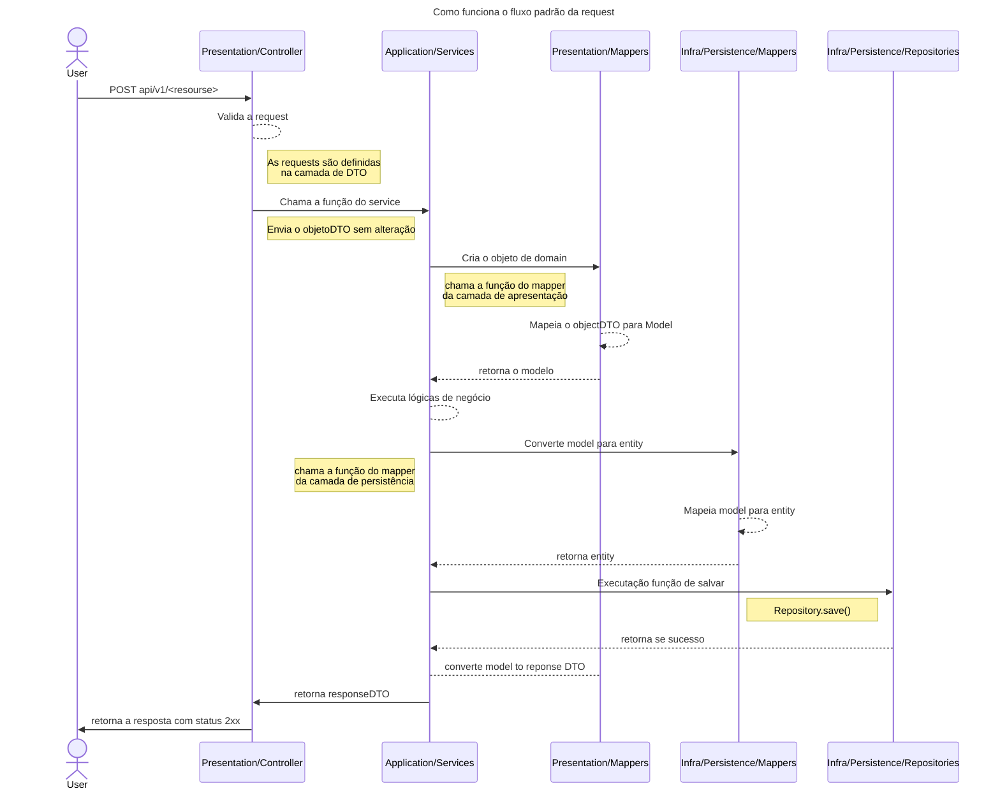
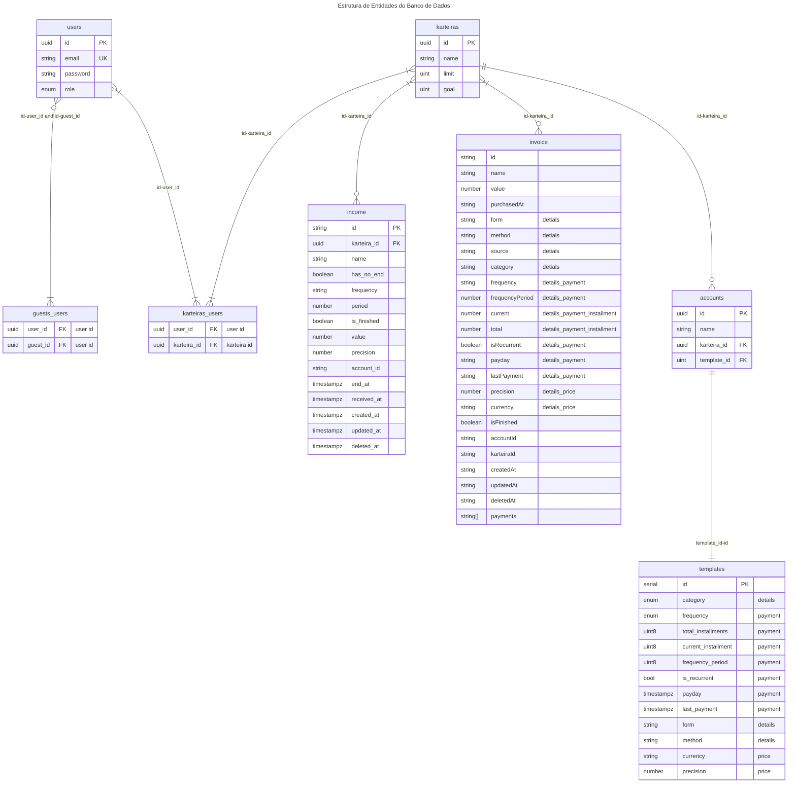

# Cara-Suja API


> Periquito-cara-suja (Pyrrhura griseipectus)
>
> **Sobre**  
> Assim, como outros membros da família dos psitacídeos, os periquitos também formam casais para a
> vida toda. O
> Periquito-de-cara-suja é uma ave exclusivamente nordestina, atualmente ele ocorre em apenas 3
> locais no estado do
> Ceara.
> É endêmica da Mata Atlântica. É uma espécie social que vive em bandos familiares de
> aproximadamente 4 a 15 indivíduos.
>
> **Ameaças**    
> Caça ilegal, tráfico de animais silvestres, destruição de ninhos e perca de habitat

<!-- TOC -->
* [Cara-Suja API](#cara-suja-api)
  * [Start](#start)
  * [Arquitetura](#arquitetura)
    * [Arquitetura do projeto](#arquitetura-do-projeto)
    * [Estrutura de Entidades do Banco de Dados](#estrutura-de-entidades-do-banco-de-dados)
<!-- TOC -->

## Start

Baixe/atualize o `code standard` para o projeto e adicione ao seu intellij.

```shell
sh scripts/getIntellijGoogleStyle.sh
```

## Arquitetura

### Arquitetura do projeto



### Estrutura de Entidades do Banco de Dados


