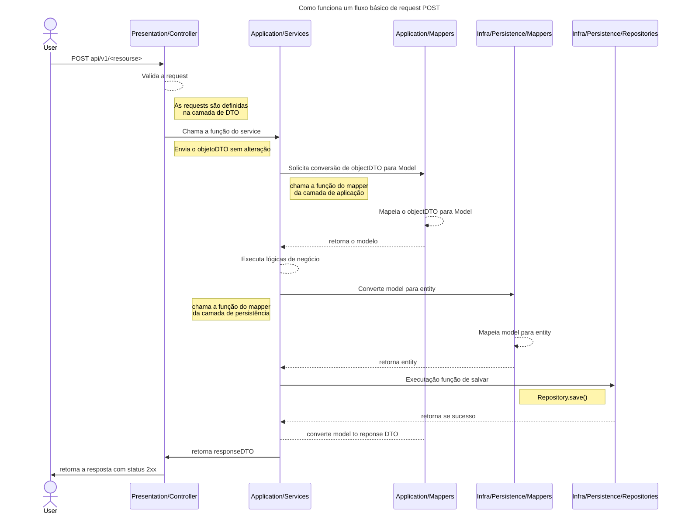

# Arquitetura do projeto

O projeto está estruturado seguindo os princípios da arquitetura limpa (Clean Architecture) e DDD
(Domain-Driven Design). A seguir, estão os principais componentes e suas responsabilidades:

- **Presentation**: Camada responsável pelos outputs da aplicação. Na qual usuários e sistemas
  tem acesso. Como se fosse a porta de entrada da aplicação.
  - **Controllers**: Recebem as requisições HTTP, validam os dados de entrada e chamam os serviços
    da camada de Application.
  - **DTOs**: Objetos de transferência de dados usados para transportar dados entre a camada de
    apresentação e a camada de aplicação. Por exemplo: RequestDTO e ResponseDTO.
- **Application**: Camada que contém a lógica de negócio da aplicação.
  - **Services**: Implementam as regras de negócio e orquestram as operações entre as diferentes
    camadas.
  - **Mappers**: Responsáveis por converter entre DTOs e modelos de domínio.
- **Domain**: Camada que representa o núcleo da aplicação.
  - **Models**: Representam as entidades e objetos de valor do domínio. Por exemplo:
    - User, Product, Order, Exceptions
  - **Interfaces**: Definem as interfaces de integração para a camada de `infrastructure`. Por
    exemplo:
    - Repositories, Security, External Services
- **Infrastructure**: Camada que lida com a persistência de dados e integrações externas.
  - **Persistence**: Implementa os repositórios definidos na camada de domínio, utilizando
    tecnologias
    específicas (ex. bancos de dados relacionais ou NoSQL).
    - **Repositories**: Implementações concretas dos repositórios para persistência de dados.
    - **Mappers**: Responsáveis por converter entre modelos de domínio e entidades de banco de
      dados.
  - **Security**: Implementações relacionadas à segurança, como autenticação e autorização

## Arquitetura do projeto



### Entities Relationship

```mermaid
---
title: Database Entities Relationship
---

erDiagram
  serial_key one to many users: serial_keys has many users
  users many(1) -- many(1) karteiras_users: associates users with karteiras
  karteiras many(1) -- many(1) karteiras_users: associates karteiras with users
  karteiras many(1) -- many(0) income: karteiras has many incomes
  karteiras many(1) -- many(0) invoice: karteiras has many invoices
  karteiras one to many accounts: karteira contains accounts
  accounts one to one templates: accounts has one template

  serial_key {
    serial id PK
    string key UK
  }

  users {
    uuid id PK
    string email UK
    string password
    enum role
    uint key_id FK
  }

  karteiras {
    uuid id PK
    string name
    uint limit
    uint goal
  }

  karteiras_users {
    uuid user_id FK "user id"
    uuid karteira_id FK "karteira id"
  }

  accounts {
    uuid id PK
    string name
    uuid karteira_id FK
    uint template_id FK
  }

  templates {
    serial id PK
    enum category "details"
    enum frequency "payment"
    uint8 total_installments "payment"
    uint8 current_installment "payment"
    uint8 frequency_period "payment"
    bool is_recurrent "payment"
    timestampz payday "payment"
    timestampz last_payment "payment"
    string form "details"
    string method "details"
    string currency "price"
    number precision "price"
  }

  income {
    string id PK
    uuid karteira_id FK
    string name
    boolean has_no_end
    string frequency
    number period
    boolean is_finished
    number value
    number precision
    string account_id
    timestampz end_at
    timestampz received_at
    timestampz created_at
    timestampz updated_at
    timestampz deleted_at
  }

  invoice {
    string id
    string name
    number value
    string purchasedAt
    string form "detials"
    string method "detials"
    string source "detials"
    string category "detials"
    string frequency "details_payment"
    number frequencyPeriod "details_payment"
    number current "details_payment_installment"
    number total "details_payment_installment"
    boolean isRecurrent "details_payment"
    string payday "details_payment"
    string lastPayment "details_payment"
    number precision "details_price"
    string currency "detials_price"
    boolean isFinished
    string accountId
    string karteiraId
    string createdAt
    string updatedAt
    string deletedAt
    string[] payments
  }
```
